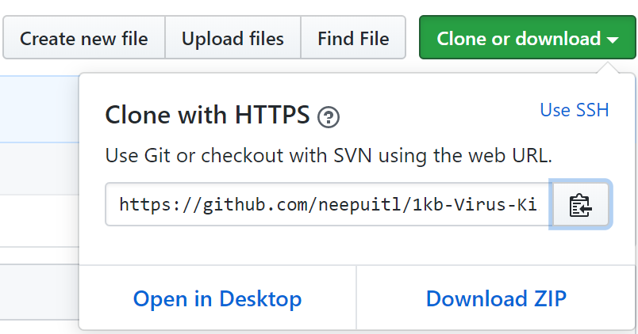

# 快捷方式（1KB）病毒
`症状`：同学们可能经常在打印店使用自己的U盘打印文档之后，发现自己U盘里的文件和文件夹全部消失了，只剩下它们的快捷方式。其实这只是病毒把所有文件和文件夹的属性设置成了系统和隐藏属性，然后再为它们建立快捷方式。这让人误以为文件全部变成了快捷方式，实际上你的文件全部都完好无损，只是看不到而已。本项目能够在帮助你快速找回文件和文件夹。

## 1. 方案
### 1.1. 环境
> 系统：`Windows`

### 1.2. 运行
插上U盘后，我们可以采用以下两种方式运行并清理病毒：

#### 1.2.1. 命令方式
```bash
git clone https://github.com/neepuitl/1kb-Virus-Killer.git
run.bat
```

#### 1.2.2. 点击方式


- 打开网址[`https://github.com/neepuitl/1kb-Virus-Killer`](https://github.com/neepuitl/1kb-Virus-Killer)；
- 点击download下载zip压缩包到本地；
- 解压压缩包并进入解压后的目录；
- 双击**run.bat**文件，即可清理病毒；
